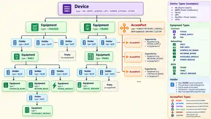
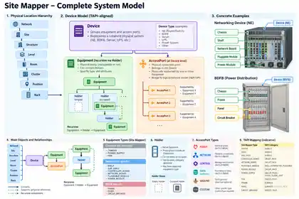

# v1.2 — Visual References

These images were supplied during the domain-model review and are preserved with the v1.2 volume as **historical / review references**.

> They are not normative diagrams for v1.2 where they show Holder nodes or Device-level AccessPort containment. The canonical v1.2 structure is defined in [domain-contract.md](./domain-contract.md).

## Device / Equipment System Model

### v1.2 reconciliation

- Keep the Device / Equipment separation.
- Replace `Equipment -> Holder -> Equipment` with direct recursive `Equipment -> Equipment`.
- For fixed positions, use `childMode = POSITIONAL` and `children[index] = EquipmentId | null`.
- AccessPort remains generic, but its physical parent is Equipment.

## Site Mapper — Complete System Model

### v1.2 reconciliation

- Keep the Site -> Structure -> Level -> Room -> Cluster -> Position -> Rack hierarchy.
- Device remains abstract / operational.
- Equipment remains physical and recursive.
- Remove Holder from the canonical domain.
- Device-level AccessPort rendering is interpreted only as an aggregate projection; physical containment is Equipment -> AccessPort.

These visual references are retained to preserve iteration history, as required by the documentation versioning policy.

## Runtime UI preservation

The v1.2 runtime port intentionally preserves the approved Full Power Trace / BDFB / Power Canvas presentation from `feat/full-power-trace-access-ports`. Canonical Device → Equipment → AccessPort semantics are supplied through projections and application adapters rather than by replacing that visual composition.
